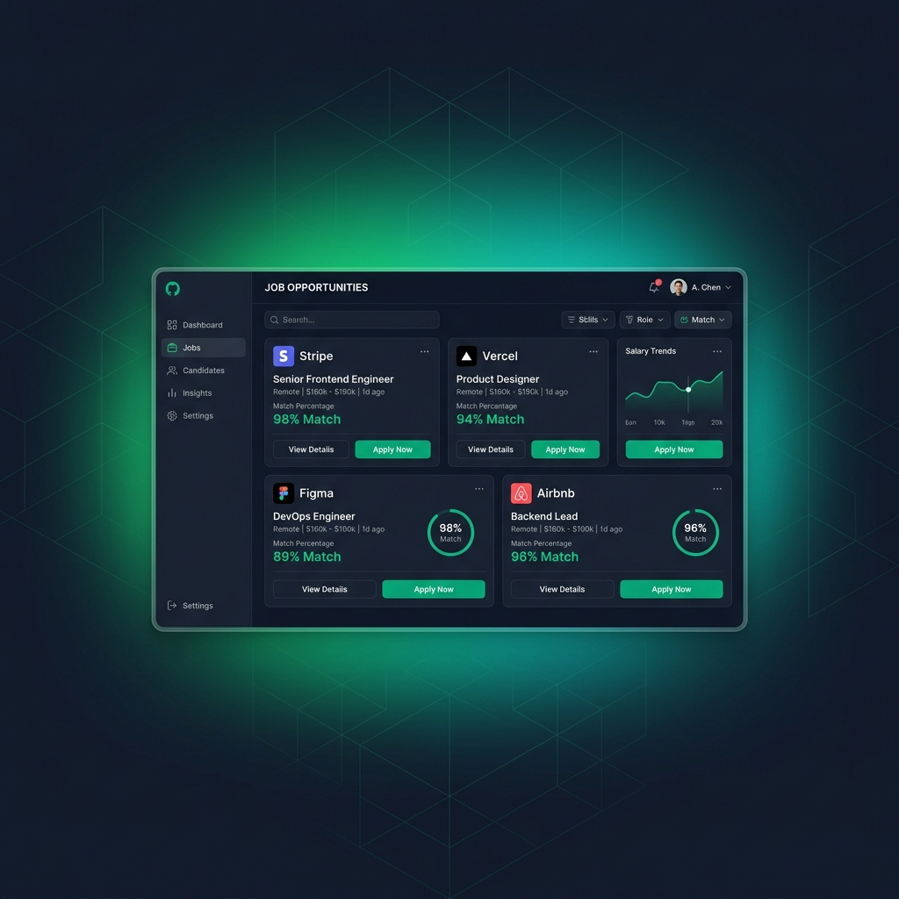
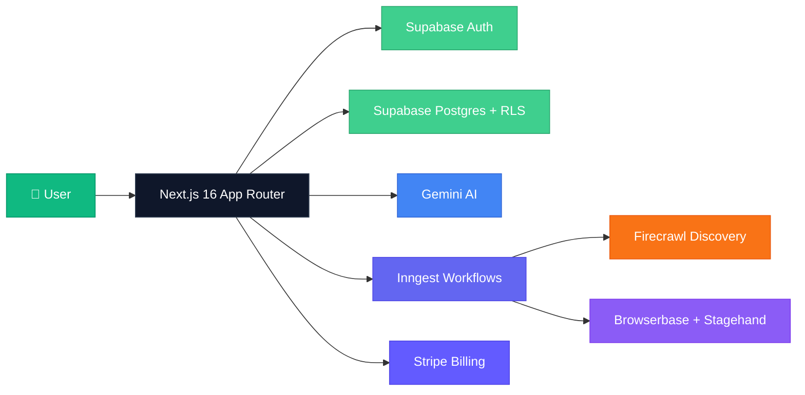

<div align="center">


# 🚀 JobMatch

### *A calmer way to manage job applications.*

[](https://nextjs.org/)
[](https://react.dev/)
[](https://typescriptlang.org/)
[](https://tailwindcss.com/)
[](https://supabase.com/)
[](https://stripe.com/)

<br />



<br />
<br />

**JobMatch** helps you organize your profile, discover relevant roles across Indian job platforms, save jobs, and track applications — without turning your job search into a spreadsheet.

[🌐 Live Demo](#) · [📖 Documentation](#-getting-started) · [🐛 Report Bug](https://github.com/Porallanagaraju13/Job-match/issues) · [✨ Request Feature](https://github.com/Porallanagaraju13/Job-match/issues)

---

</div>

## ✨ Features

<table>
<tr>
<td width="50%">

### 🎯 Focused Job Feed
Aggregate roles from **Naukri**, **Instahyre**, **IIMJobs**, **Hirist**, **Foundit**, and **Wellfound** — all in one unified dashboard.

</td>
<td width="50%">

### 📊 AI-Powered Match Scores
Get intelligent fit scores powered by **Gemini AI** that compare your resume against job requirements in real-time.

</td>
</tr>
<tr>
<td width="50%">

### 📝 Smart Resume Parsing
Upload your resume and let AI extract structured profile data — skills, experience, education — automatically.

</td>
<td width="50%">

### 🔖 Saved Jobs & Bookmarks
Keep a curated shortlist of opportunities and come back when you're ready to apply.

</td>
</tr>
<tr>
<td width="50%">

### 📈 Application Tracking
Know exactly what's missing, in progress, ready for review, or submitted — all at a glance.

</td>
<td width="50%">

### 🛡️ Privacy First
Resume files are **private** and user-scoped. You review everything before final submission. Your data stays yours.

</td>
</tr>
</table>

---

## 🏗️ Architecture



---

## 🛠️ Tech Stack

<div align="center">

| Layer | Technology | Purpose |
|:---:|:---|:---|
| 🖥️ **Frontend** | Next.js 16, React 19, TypeScript | App Router, Server Components, SSR |
| 🎨 **Styling** | Tailwind CSS 4, shadcn/ui | Utility-first CSS, accessible components |
| 🔐 **Auth** | Supabase Auth + Google OAuth | Secure authentication & session management |
| 🗄️ **Database** | Supabase Postgres + RLS | Row-level security, user-scoped data |
| 🤖 **AI** | Google Gemini API | Resume parsing, job matching, fit scoring |
| ⚡ **Workflows** | Inngest | Durable background jobs & orchestration |
| 🌐 **Scraping** | Firecrawl + Greenhouse/Lever adapters | Job discovery from multiple platforms |
| 🤖 **Automation** | Browserbase + Stagehand | Application form scanning |
| 💳 **Payments** | Stripe Checkout + Webhooks | Subscription billing & portal |
| 🧪 **Testing** | Vitest + Coverage | Unit & integration testing |

</div>

---

## 🚀 Getting Started

### Prerequisites

- **Node.js** `20+` (see [.nvmrc](.nvmrc))
- **npm** `9+`

### Quick Start

```bash
# 1️⃣ Clone the repository
git clone https://github.com/Porallanagaraju13/Job-match.git
cd Job-match

# 2️⃣ Install dependencies
npm install

# 3️⃣ Start development server
npm run dev
```

> 🌐 Open **http://localhost:3000** — the app runs in **Demo Mode** with no secrets required!

### 🔌 Connect Providers (Optional)

```bash
# Copy environment template
cp .env.example .env.local
```

Fill in only the providers you want to enable:

<details>
<summary>📋 <b>Environment Variables Reference</b></summary>

| Variable | Provider | Required |
|:---|:---|:---:|
| `NEXT_PUBLIC_SUPABASE_URL` | Supabase | Optional |
| `NEXT_PUBLIC_SUPABASE_PUBLISHABLE_KEY` | Supabase | Optional |
| `SUPABASE_SECRET_KEY` | Supabase | Optional |
| `STRIPE_SECRET_KEY` | Stripe | Optional |
| `STRIPE_WEBHOOK_SECRET` | Stripe | Optional |
| `STRIPE_PRO_PRICE_ID` | Stripe | Optional |
| `STRIPE_POWER_PRICE_ID` | Stripe | Optional |
| `GEMINI_API_KEY` | Google AI | Optional |
| `GEMINI_MODEL` | Google AI | Optional |
| `INNGEST_EVENT_KEY` | Inngest | Optional |
| `INNGEST_SIGNING_KEY` | Inngest | Optional |
| `BROWSERBASE_API_KEY` | Browserbase | Optional |
| `BROWSERBASE_PROJECT_ID` | Browserbase | Optional |

> ⚠️ **Never commit `.env.local`** — it's already in `.gitignore`.

</details>

---

## 🧪 Verification

```bash
# Type checking
npm run typecheck

# Linting
npm run lint

# Run tests
npm run test

# Production build
npm run build
```

The health endpoint is available at `GET /api/health` — it reports integration status without exposing secrets.

---

## 🗄️ Database Setup

Apply SQL migrations from `supabase/migrations/` using the Supabase CLI or dashboard. The initial migration creates:

<details>
<summary>📋 <b>Database Schema Overview</b></summary>

- 👤 User-owned **profile**, **resume**, **saved-job**, **application**, **billing**, **usage**, and **activity** tables
- 🌐 Global normalized **job catalog**
- 🔒 Private **resume storage** bucket
- 🛡️ **RLS policies** for user-scoped data access
- 🎫 New-user **trigger** with default Free subscription
- 💳 Stripe event **idempotency** records

</details>

Configure **Google OAuth** in Supabase and add `/auth/callback` to permitted redirect URLs.

---

## ⚙️ Durable Workflows

The `/api/inngest` endpoint serves:

| Workflow | Description |
|:---|:---|
| 📄 **Resume Processing** | AI-powered extraction and structuring |
| 🔄 **Job Source Refresh** | Scheduled discovery across platforms |
| 📋 **Application Prep** | Form scanning and answer preparation |

> All workflows are concurrency-limited per user and platform. Browser runs are **scan-only** — final submission always requires explicit user review.

---

## 🔒 Security & Privacy

<div align="center">

| Principle | Implementation |
|:---|:---|
| 🔐 **Private Storage** | Resume files are private and user-scoped |
| 🛡️ **Row Level Security** | Server checks and RLS are authoritative |
| 🚫 **No Inference** | Demographics are never inferred |
| ✋ **User Control** | CAPTCHA, MFA, and consent require user action |
| 💳 **Webhook Sync** | Stripe webhooks, not redirects, sync access |
| 🔑 **Idempotency** | Background side effects use idempotency keys |

</div>

---

## 📂 Project Structure

```
jobbuddy-ai/
├── 📁 src/
│   ├── 📁 app/              # Next.js App Router pages & API routes
│   │   ├── 📁 (auth)/       # Auth-gated routes
│   │   ├── 📁 api/          # API endpoints (health, inngest, stripe)
│   │   ├── 📁 app/          # Main dashboard
│   │   ├── 📁 onboarding/   # User onboarding flow
│   │   ├── 📁 pricing/      # Pricing page
│   │   └── 📄 page.tsx      # Landing page
│   ├── 📁 components/       # Reusable UI components
│   │   ├── 📁 brand/        # Brand mark & identity
│   │   ├── 📁 billing/      # Subscription UI
│   │   ├── 📁 marketing/    # Header, footer, CTA
│   │   └── 📁 ui/           # shadcn/ui primitives
│   ├── 📁 features/         # Feature modules
│   │   ├── 📁 applications/ # Application tracking
│   │   ├── 📁 auth/         # Authentication logic
│   │   ├── 📁 jobs/         # Job feed & matching
│   │   ├── 📁 profile/      # Profile management
│   │   └── 📁 resumes/      # Resume upload & parsing
│   ├── 📁 server/           # Server-side logic
│   └── 📁 lib/              # Shared utilities
├── 📁 supabase/              # Database migrations
├── 📁 public/                # Static assets
├── 📁 tests/                 # Test suites
└── 📄 package.json
```

---

## 🤝 Contributing

Contributions are welcome! Here's how to get started:

1. **Fork** the repository
2. **Create** a feature branch: `git checkout -b feature/amazing-feature`
3. **Commit** your changes: `git commit -m 'Add amazing feature'`
4. **Push** to the branch: `git push origin feature/amazing-feature`
5. **Open** a Pull Request

---

## 📄 License

This project is for educational and personal use. See the [LICENSE](LICENSE) file for details.

---

<div align="center">

### 💚 Built with passion for job seekers

<br />

**[⬆ Back to Top](#-jobmatch)**

<br />

Made with ❤️ by [Nagaraju Poralla](https://github.com/Porallanagaraju13)

</div>
